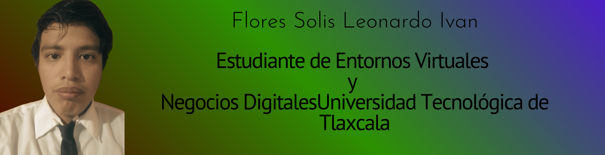
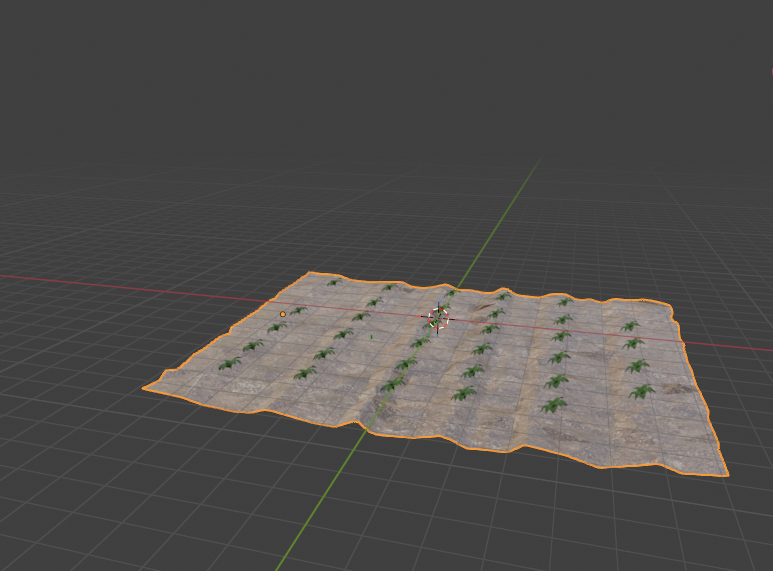
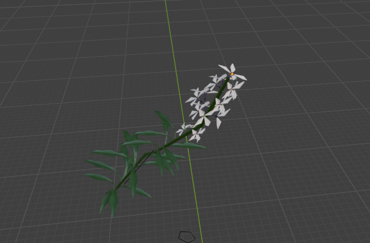
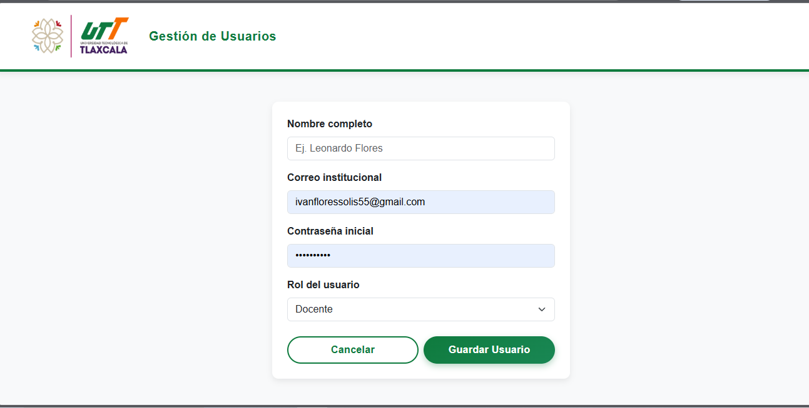

 

<h2>Perfil Profesional</h2>

<h2>Mis redes</h2>

  
✉️ Email: <a>ivanfloressolis55@gmail.com</a>

  
📘 Facebook: <a href="https://www.facebook.com/profile.php?id=61586845393734" target="_blank">Ver perfil</a>

  
🐙 GitHub: <a href="https://github.com/Ivan5514" target="_blank">Ver perfil</a>

  
📱 Numero: <a>247-250-4583</a>

  
<h2>🧑 Sobre mí</h2>

Me considero una persona creativa, resiliente y empática, profundamente apasionada por las actividades y proyectos que me interesan. Me caracterizo por ser una persona comprometida y competente, con una gran capacidad para analizar situaciones y encontrar soluciones efectivas ante los desafíos que se presenten.

<section class="section">
<h2> Habilidades Técnicas</h2>

<ul>
<li><strong>Herramientas de diseño y software:</strong> experiencia utilizando herramientas para diseño, edición y producción de contenido multimedia.</li>

<li><strong>Edición y producción audiovisual:</strong> capacidad para crear y editar material visual y audiovisual con fines creativos y comunicativos.</li>

<li><strong>Planificación y gestión de proyectos:</strong> organización, desarrollo y seguimiento de proyectos creativos o digitales.</li>

<li><strong>Administración de redes sociales:</strong> manejo de perfiles digitales, interacción con la audiencia y publicación de contenido.</li>

<li><strong>Desarrollo de contenido digital:</strong> creación de material visual y audiovisual para diferentes plataformas.</li>

</ul>
</section>

<section class="section">
<h2>Habilidades Personales</h2>

<ul>

<li><strong>Creatividad digital:</strong> generación de ideas innovadoras aplicadas a proyectos tecnológicos y multimedia.</li>

<li><strong>Pensamiento crítico:</strong> análisis de situaciones para encontrar soluciones eficientes.</li>

<li><strong>Adaptabilidad tecnológica:</strong> facilidad para aprender y utilizar nuevas herramientas digitales.</li>

<li><strong>Trabajo colaborativo:</strong> experiencia trabajando en equipo en proyectos creativos y tecnológicos.</li>

<li><strong>Comunicación efectiva:</strong> capacidad para expresar ideas de manera clara en distintos entornos.</li>

<li><strong>Resolución de problemas:</strong> habilidad para enfrentar desafíos y encontrar soluciones prácticas.</li>

<li><strong>Gestión del tiempo:</strong> organización eficiente de tareas y proyectos.</li>

<li><strong>Proactividad:</strong> iniciativa para proponer ideas y mejorar procesos.</li>

</ul>

</section>

<h2>Idiomas</h2>
<ul>
<li>Español – Nativo</li>
<li>Inglés – Básico / Intermedio</li>
</ul>

</body>
</html>

<section class="section">

<h2> Software que manejo</h2>

<h3> Diseño y Producción Multimedia</h3>
<ul>
<li><a href="https://www.blender.org/" target="_blank">Blender</a></li>
<li><a href="https://unity.com/" target="_blank">Unity</a></li>
<li><a href="https://www.adobe.com/products/photoshop.html" target="_blank">Adobe Photoshop</a></li>
<li><a href="https://www.adobe.com/products/premiere.html" target="_blank">Adobe Premiere Pro</a></li>
<li><a href="https://krita.org/" target="_blank">Krita</a></li>
<li><a href="https://www.canva.com/" target="_blank">Canva</a></li>
</ul>

<h3>Desarrollo Web y Programación</h3>
<ul>
<li><a href="https://developer.mozilla.org/es/docs/Web/HTML" target="_blank">HTML</a></li>
<li><a href="https://developer.mozilla.org/es/docs/Web/CSS" target="_blank">CSS</a></li>
<li><a href="https://getbootstrap.com/" target="_blank">Bootstrap</a></li>
<li><a href="https://www.python.org/" target="_blank">Python</a></li>
<li><a href="https://learn.microsoft.com/es-es/dotnet/csharp/" target="_blank">C#</a></li>
</ul>

<h3> Gestión de Bases de Datos</h3>
<ul>
<li><a href="https://www.postgresql.org/" target="_blank">PostgreSQL</a></li>
<li><a href="https://www.mysql.com/" target="_blank">MySQL</a></li>
<li><a href="https://www.apachefriends.org/es/index.html" target="_blank">XAMPP</a></li>
</ul>

</section>

<h3>Certificados</h3>

<h3> Certificados </h3> <a href="certificados/" style=" display:inline-block; padding:10px 20px; background:#2e7d32; color:white; text-decoration:none; border-radius:5px; font-weight:bold; "> 📜 Ver Certificados </a>

<section class="section">
    <h2>🚀 Mis Proyectos</h2>

<li>
            <a href="https://www.youtube.com/watch?v=dhOyi26mAU8" target="_blank">
                Video de Usabilidad: Página de Gestión de Laboratorios
            </a>
        </li>
    </ul>

<h3>Animación y Narrativa Digital</h3>
    <ul>
        <li>
            <a href="https://youtu.be/z0yBdu0tAQY" target="_blank">
                Cortometraje Animado: El Camino a ser Quien Soy (Concientización)
            </a>
        </li>
    </ul>
</section>

<section class="section">
    <h2>Imágenes de Proyectos</h2>
    

        
        
        
    

</section>

<a href="pdf/" target="_blank" style=" display:inline-block; padding:12px 22px; background:#d32f2f; color:white; text-decoration:none; border-radius:6px; font-weight:bold; "> 📄 Ver CV en PDF

